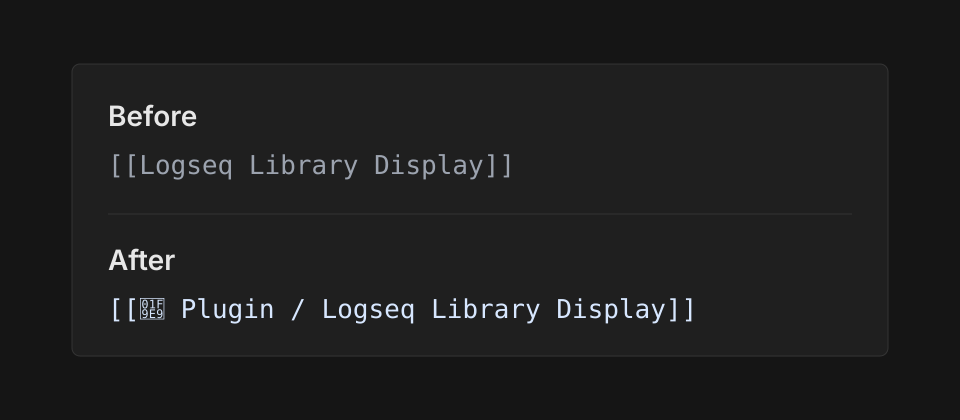

# Logseq Library Display

Logseq Library Display makes Logseq DB page references easier to scan by showing a referenced page together with its parent page.

For a DB entity like `Logseq Library Display` whose `:block/parent` is `Plugin`, normal references that render as:

```text
[[Logseq Library Display]]
```

can be displayed as:

```text
[[Plugin / Logseq Library Display]]
[[🧩 Plugin / Logseq Library Display]]
[[🧩 / Logseq Library Display]]
```



## Features

- Reads Logseq DB graph data from the local Logseq plugin API.
- Detects referenced DB entities through `:block/refs`.
- Looks up each referenced entity's `:block/parent`.
- Uses the parent page's `:block/title` as the displayed prefix.
- Uses the parent page's `:logseq.property/icon` when it is available.
- Supports `Text`, `Icon + Text`, and `Icon` display modes.

The plugin is intended for Logseq DB graphs. It does not add or edit blocks; it only changes how matching page references are displayed.

## Display Modes

`Text`

```text
[[Plugin / Logseq Library Display]]
```

`Icon + Text`

```text
[[🧩 Plugin / Logseq Library Display]]
```

`Icon`

```text
[[🧩 / Logseq Library Display]]
```

If the parent page has no icon, icon modes fall back to text.

## Installation

Install from the Logseq Marketplace after the plugin is accepted.

For local development:

```sh
pnpm install
pnpm build
```

Then enable Logseq developer mode and load the plugin root directory:

```text
/Users/rien7/Developer/logseq-plugin/logseq-library-display
```

Do not load the `dist` directory directly. The root `package.json` is the plugin package configuration, and its `main` field points Logseq to `index.html`.

## Development

```sh
pnpm install
pnpm build
pnpm package
```

`pnpm package` creates `release/logseq-library-display.zip`, which is the release artifact expected by the Logseq Marketplace.

## License

MIT
